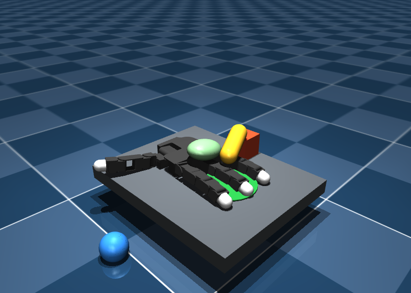
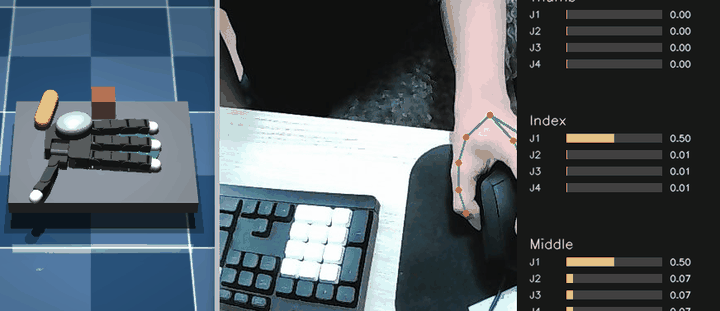
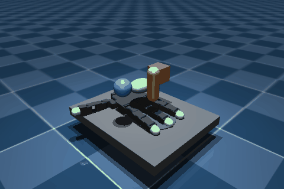

# Dex-Keypoint Teleop

Webcam hand tracking with MediaPipe retargeted to the **MuJoCo Menagerie
Allegro Hand V3 right-hand model**. The Allegro palm stays fixed while the
tracked fingers manipulate objects on a tabletop task scene. This project is
simulation-only; it does not control physical robot hardware.



**Live webcam teleoperation**



**MuJoCo finger-motion simulation preview**



## Requirements

- Python 3.10, 3.11, or 3.12
- A webcam accessible to the camera process
- WSLg or another desktop display for the MuJoCo and OpenCV windows

## Install in WSL2

From the project root:

```bash
python3 -m venv .venv
source .venv/bin/activate
python -m pip install --upgrade pip
python -m pip install -e .
```

The editable install registers the `dex-teleop` command and includes the
MuJoCo XML model, meshes, and their BSD-2-Clause license.

## Run with a Windows webcam

Keep the webcam attached to Windows. Do not pass it through `usbipd` to WSL.

1. In a WSL terminal, start the hand-tracking, task, and frame receiver:

   ```bash
   dex-teleop --tcp-camera --mujoco
   ```

2. In a separate Windows PowerShell, enter the sender folder in the Windows
   copy of the repository, then install and run the small camera sender:

   ```powershell
   cd C:\path\to\Dex-Keypoint\windows_camera_sender
   .\setup_camera_sender.ps1
   .\run_camera_sender.ps1
   ```

   If scripts are blocked by the execution policy, run them with
   `powershell -ExecutionPolicy Bypass -File .\setup_camera_sender.ps1` and
   `powershell -ExecutionPolicy Bypass -File .\run_camera_sender.ps1`.

The Windows side captures and JPEG-encodes frames only. MediaPipe inference,
retargeting, task simulation, and visualization run in WSL. The default
localhost TCP port is `8765`. Keep the unauthenticated frame receiver on
localhost/a trusted network; do not expose it publicly.

To use a different Windows camera, pass `-Camera 1` to the sender. To change
the TCP port, pass `--port 8766` in WSL and `-Port 8766` to the PowerShell
sender.

## Direct-camera alternative

On Linux systems where the camera is visible to OpenCV:

```bash
dex-teleop --camera 0 --mujoco
```

For tracking/target preview without MuJoCo, omit `--mujoco`. Press `q` or
`Esc` in the camera preview to quit; press `r` there to reset the task.

## Task interaction

- Use webcam-tracked finger curl to push and grasp the task objects.
- The Allegro base is fixed; this is not a whole-hand navigation task.
- The scene has an open tabletop, four movable objects, and a green goal zone.
- The camera preview displays the number of objects in the goal.
- Focus the MuJoCo window to orbit/zoom with the mouse.

## Retargeting limitations

The current human-to-Allegro mapping is a provisional normalized flexion
mapping, not calibrated kinematic retargeting. The little finger is tracked
for features but the Allegro Hand V3 has no little-finger digit. Validate
mapping and safety before adapting this software to physical hardware.

## Development and tests

```bash
python -m unittest discover -s tests -v
```

The bundled MJCF, meshes, and license are from
[Google DeepMind MuJoCo Menagerie](https://github.com/google-deepmind/mujoco_menagerie/tree/main/wonik_allegro).
