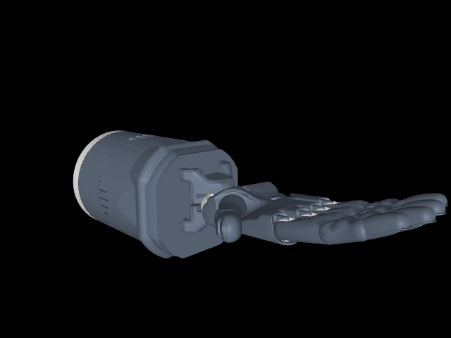

# Dex-Keypoint Teleop

Webcam hand tracking with MediaPipe retargeted to the **MuJoCo Menagerie
Allegro Hand V3 right-hand model**. The Allegro palm stays fixed while the
tracked fingers manipulate objects on a tabletop task scene. This project is
simulation-only; it does not control physical robot hardware.


**Live webcam teleoperation**


**MuJoCo finger-motion simulation preview**


## Requirements

- Python 3.10, 3.11, or 3.12
- A webcam accessible to the camera process
- WSLg or another desktop display for the MuJoCo and OpenCV windows

## Install in WSL2

From the project root:

```bash
python3 -m venv .venv
source .venv/bin/activate
python -m pip install --upgrade pip
python -m pip install -e .
```

The editable install registers the `dex-teleop` command and includes the
MuJoCo XML model, meshes, and their BSD-2-Clause license.

An existing project virtual environment can be reused. If its Python has no
`pip`, no install is needed to run the source from this project directory.

## Run with a Windows webcam

Keep the webcam attached to Windows. Do not pass it through `usbipd` to WSL.

1. In a WSL terminal, start the hand-tracking, task, and frame receiver:

   ```bash
   dex-teleop --tcp-camera --mujoco
   ```

2. In a separate Windows PowerShell, enter the sender folder in the Windows
   copy of the repository, then install and run the small camera sender:

   ```powershell
   cd C:\path\to\Dex-Keypoint\windows_camera_sender
   .\setup_camera_sender.ps1
   .\run_camera_sender.ps1
   ```

   If scripts are blocked by the execution policy, run them with
   `powershell -ExecutionPolicy Bypass -File .\setup_camera_sender.ps1` and
   `powershell -ExecutionPolicy Bypass -File .\run_camera_sender.ps1`.

The Windows side captures and JPEG-encodes frames only. MediaPipe inference,
retargeting, task simulation, and visualization run in WSL. The default
localhost TCP port is `8765`. Keep the unauthenticated frame receiver on
localhost/a trusted network; do not expose it publicly.

To use a different Windows camera, pass `-Camera 1` to the sender. To change
the TCP port, pass `--port 8766` in WSL and `-Port 8766` to the PowerShell
sender.

## Direct-camera alternative

On Linux systems where the camera is visible to OpenCV:

```bash
dex-teleop --camera 0 --mujoco
```

For tracking/target preview without MuJoCo, omit `--mujoco`. Press `q` or
`Esc` in the camera preview to quit; press `r` there to reset the task.

## Task interaction

- Use webcam-tracked finger curl to push and grasp the task objects.
- The Allegro base is fixed; this is not a whole-hand navigation task.
- The scene has an open tabletop, four movable objects, and a green goal zone.
- The camera preview displays the number of objects in the goal.
- Focus the MuJoCo window to orbit/zoom with the mouse.

## Kinematic hand retargeting

`dex-retarget` (or `python -m dex_retargeting.teleop`) defaults to a responsive
finger-flexion mapping. `--method ik` enables the experimental MediaPipe
fingertip-to-joint least-squares optimizer. From the project root:

```bash
./.venv/bin/python -m dex_retargeting.teleop --camera 0
./.venv/bin/python -m dex_retargeting.teleop --video demo.mp4
./.venv/bin/python -m dex_retargeting.teleop --tcp-camera
./.venv/bin/python -m dex_retargeting.teleop --tcp-camera --method ik
```

For the Windows webcam sender workflow, run `--tcp-camera` in WSL, then start
`windows_camera_sender/run_camera_sender.ps1` in Windows PowerShell. The
default TCP port is `8765`. Use `--no-viewer` to process landmarks without
opening the MuJoCo hand window, `--handedness any` to accept either MediaPipe
hand label, and `--config` to select another robot profile. The default
flexion mode applies a 100 ms low-pass filter and rate limit to damp tracking
jitter. See
[RETARGETING.md](RETARGETING.md) and
`configs/allegro_right.json` for the profile and implementation details.
The experimental IK coordinate transform is an initial identity mapping and
may need calibration for the camera orientation. This preview is
simulation-only and does not send hardware commands.

The LEAP Hand profile uses a model converted from its official URDF:

```bash
./.venv/bin/python -m dex_retargeting.teleop --tcp-camera --config configs/leap_hand.json
```

Switch `--config` back to `configs/allegro_right.json` for Allegro.

The Shadow Hand profile maps its five fingers and two wrist axes:



```bash
./.venv/bin/python -m dex_retargeting.teleop --tcp-camera --config configs/shadow_hand.json
```

Wrist tilt is relative to the first tracked pose. Press `c` in the preview to
recalibrate its neutral pose. The Shadow profile starts with a conservative
visualization mapping; it is not a hardware controller.

## Development and tests

```bash
python -m unittest discover -s tests -v
```

The bundled MJCF, meshes, and license are from
[Google DeepMind MuJoCo Menagerie](https://github.com/google-deepmind/mujoco_menagerie/tree/main/wonik_allegro).
